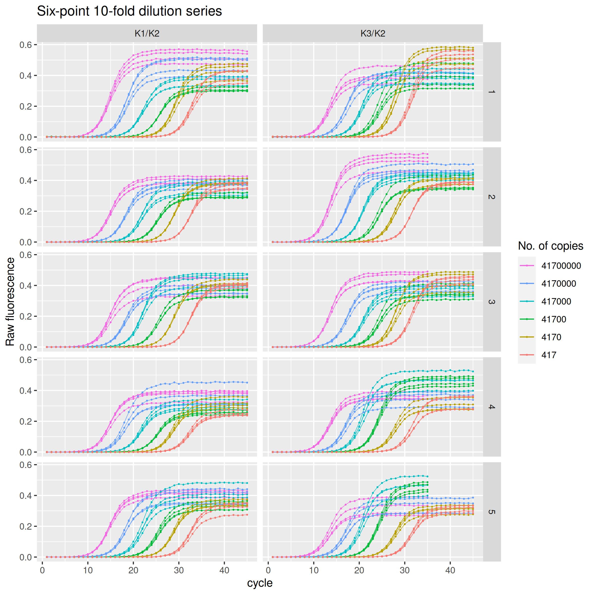

<!-- README.md is generated from README.Rmd. Please edit that file -->

# rutledge

<!-- badges: start -->

[](https://CRAN.R-project.org/package=rutledge)
[](https://github.com/ramiromagno/rutledge/actions/workflows/R-CMD-check.yaml)
<!-- badges: end -->

`{rutledge}` is an R data package that provides real-time PCR raw
fluorescence data by Rutledge et al. (2004) in tidy format.

The eponymous data set `rutledge` comprises a six-point, ten-fold
dilution series repeated in 5 independent runs. In each run, for each
concentration there are four replicates. Of a total of 240 amplification
curves, 212 curves are 45 cycles long and 28 curves are 35 cycles long
only. The data is for two targets (amplicons): K1/K2, 102 bp, and K3/K2,
218 bp.

## Installation

Install `{rutledge}` from CRAN:

``` r
# Install from CRAN
install.packages("rutledge")
```

You can install the development version of `{rutledge}` like so:

``` r
# install.packages("remotes")
remotes::install_github("ramiromagno/rutledge")
```

## Data

`rutledge` is provided as a tidy data set, in long format, i.e. each row
is for an amplication curve point (cycle/fluor).

``` r
library(rutledge)
rutledge
#> # A tibble: 10,800 × 10
#>    plate well  dye   target sample_type replicate   copies dilution cycle  fluor
#>    <fct> <fct> <chr> <fct>  <fct>           <int>    <int>    <int> <dbl>  <dbl>
#>  1 1     <NA>  SYBR  K1/K2  std                 1 41700000        1     1 0     
#>  2 1     <NA>  SYBR  K1/K2  std                 1 41700000        1     2 0     
#>  3 1     <NA>  SYBR  K1/K2  std                 1 41700000        1     3 0     
#>  4 1     <NA>  SYBR  K1/K2  std                 1 41700000        1     4 0     
#>  5 1     <NA>  SYBR  K1/K2  std                 1 41700000        1     5 0.0007
#>  6 1     <NA>  SYBR  K1/K2  std                 1 41700000        1     6 0.0022
#>  7 1     <NA>  SYBR  K1/K2  std                 1 41700000        1     7 0.0005
#>  8 1     <NA>  SYBR  K1/K2  std                 1 41700000        1     8 0.0047
#>  9 1     <NA>  SYBR  K1/K2  std                 1 41700000        1     9 0.0107
#> 10 1     <NA>  SYBR  K1/K2  std                 1 41700000        1    10 0.0203
#> # ℹ 10,790 more rows
```

The `rutledge` data set comprises 240 amplification curves: 2 amplicons
$\times$ 5 runs (plates) $\times$ 6 dilution levels $\times$ 4
replicates.

``` r
rutledge |>
  dplyr::count(plate, target, copies, replicate)
#> # A tibble: 240 × 5
#>    plate target copies replicate     n
#>    <fct> <fct>   <int>     <int> <int>
#>  1 1     K1/K2     417         1    45
#>  2 1     K1/K2     417         2    45
#>  3 1     K1/K2     417         3    45
#>  4 1     K1/K2     417         4    45
#>  5 1     K1/K2    4170         1    45
#>  6 1     K1/K2    4170         2    45
#>  7 1     K1/K2    4170         3    45
#>  8 1     K1/K2    4170         4    45
#>  9 1     K1/K2   41700         1    45
#> 10 1     K1/K2   41700         2    45
#> # ℹ 230 more rows

rutledge |>
  ggplot(mapping = aes(
    x = cycle,
    y = fluor,
    group = interaction(plate, target, copies, replicate),
    col = as.character(copies)
  )) +
  geom_line(linewidth = 0.2) +
  geom_point(size = 0.2) +
  labs(y = "Raw fluorescence", colour = "No. of copies", title = "Six-point 10-fold dilution series") +
  guides(color = guide_legend(override.aes = list(linewidth = 0.5), reverse = TRUE)) +
  facet_grid(rows = vars(plate), cols = vars(target))
#> Warning: Removed 280 rows containing missing values or values outside the scale range
#> (`geom_line()`).
#> Warning: Removed 280 rows containing missing values or values outside the scale range
#> (`geom_point()`).
```



## Code of Conduct

Please note that the rutledge project is released with a [Contributor
Code of
Conduct](https://contributor-covenant.org/version/2/1/CODE_OF_CONDUCT.html).
By contributing to this project, you agree to abide by its terms.

## References

R. G. Rutledge. *Sigmoidal curve-fitting redefines quantitative
real-time PCR with the prospective of developing automated
high-throughput applications*. Nucleic Acids Research 32:e178 (2004).
doi: [10.1093/nar/gnh177](https://doi.org/10.1093/nar/gnh177).
